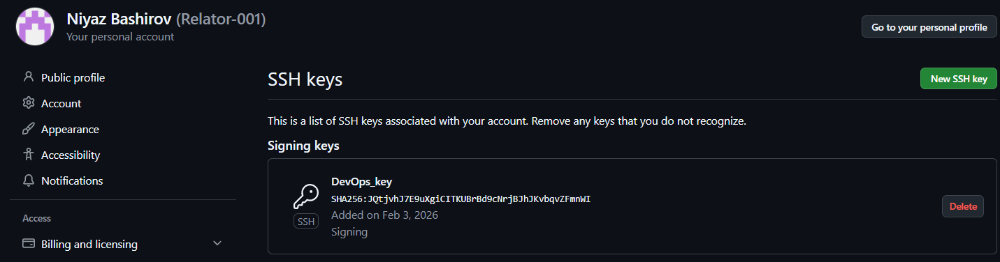
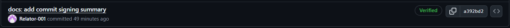
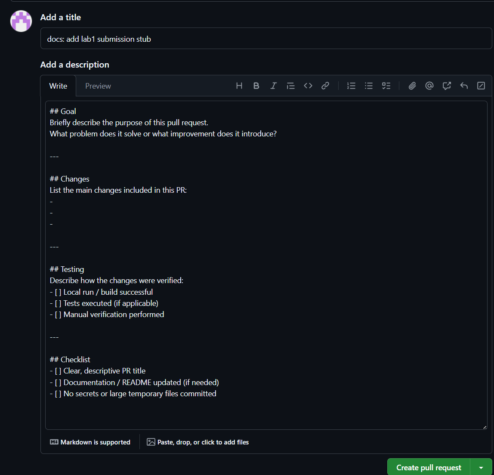
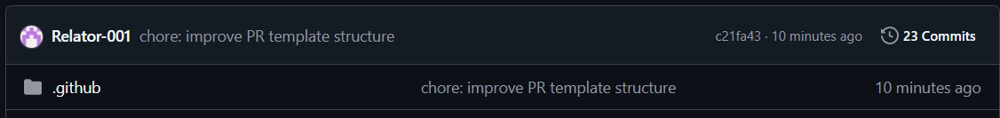

## Lab 1 — Task 1

### Benefits of signing commits
Signed commits protect developers from impersonation and unauthorized changes.
They help ensure that commits are created by verified authors and were not modified after signing.
As a result, commit signing increases trust in shared repositories and preserves the authenticity and integrity of the commit history.

### Why is commit signing important in DevOps workflows?
DevOps workflows rely on automation, CI/CD pipelines, and collaboration between multiple stakeholders.
Commit signing adds an extra layer of security by verifying the author of each change.
This improves traceability, supports auditing, and helps ensure that only trusted and verified code is merged and deployed.

### Evidence of successful SSH key setup and signed commit
- An SSH signing key was generated and added to GitHub as a signing key
- Git was configured to sign commits using SSH
- A signed commit was pushed to the repository
- GitHub displays the commit with a **Verified** badge

### Verification

### Autofill proof

### Evidence of file existence

### Analysis: How PR templates improve collaboration

Pull request templates improve collaboration by standardizing the structure of PR descriptions.
They ensure that every contributor provides the same essential information, such as the goal of the change,
a summary of modifications, and testing details. This makes reviews faster and more efficient, reduces
misunderstandings, and helps reviewers focus on the actual code instead of asking for missing context.
PR templates also promote better discipline and consistency across the team.

### Challenges encountered during setup

The main challenge during setup was understanding how GitHub loads pull request templates.
The template must exist on the default branch (main) in the `.github` directory in order to auto-fill
the PR description. Additionally, working with multiple branches required careful attention to avoid
confusion when switching branches and syncing changes.
